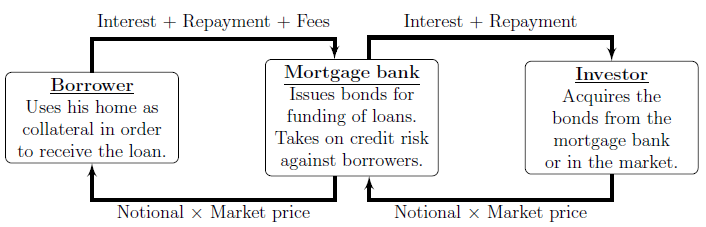
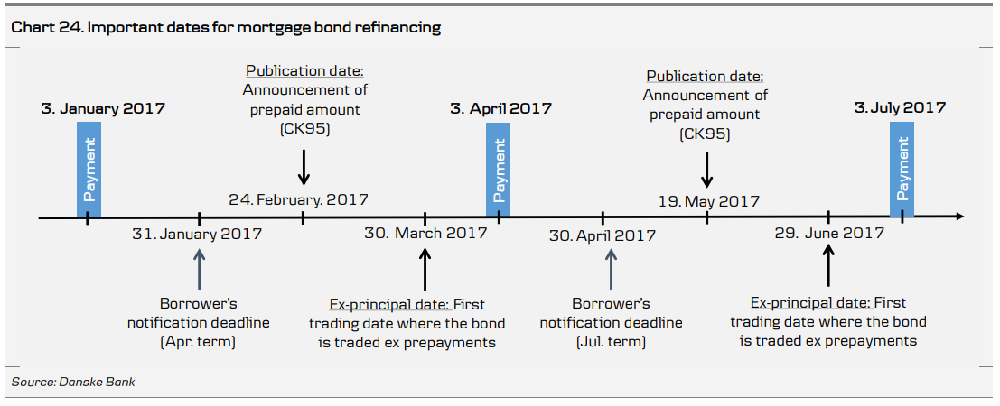
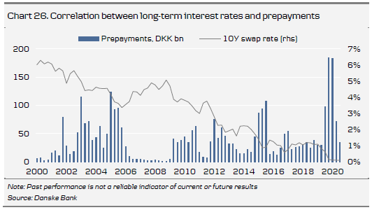
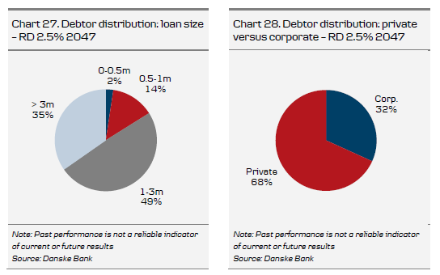
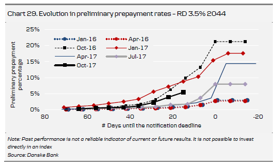

<!--
This is for including Chapter 1.  Notice that it's also good practice to name your chunk.  This will help you debug potential issues as you knit.  The chunk above is called intro and the one below is called chapter1.  Feel free to change the name of the Rmd file as you wish, but don't forget to change it here from chap1.Rmd.
-->

<!--
The {#rmd-basics} text after the chapter declaration will allow us to link throughout the document back to the beginning of Chapter 1.  These labels will automatically be generated (if not specified) by changing the spaces to hyphens and capital letters to lowercase.  Look for the reference to this label at the beginning of Chapter 2.
-->

# Introduction {#intro}

Mortgage bonds have a long history in Denmark, originating from 1797 where a fire in Copenhagen destroyed most of the city in 1795, this event initiated the first mortgage bank [@jensen2013rentesregning]. 

The general idea on how the mortgage system in Denmark has since only seen minor changes thus a source of high stability. 

The idea being the system that instead of having a one-to-one relationship between the borrower mortgage loan and the investors mortgage bond. 

The Danish mortgage system is structured such that borrowers have their loans pooled, to which bonds is issue.  

When an investor buys a bond issued from the pool, this is equivalent to buying a share of the pooled loans, in which the investor is entitled to receive interest payments and repayment proportional to the invested amount.  

What makes the Danish mortgage system distinguishable is the balance principle. This principle ensures an almost perfect match between the interest and repayments paid and received by the borrowers and investors respectively.  

Figure \@ref(fig:bondCashFlow) illustrates the cash flows that occurs between the borrow, the mortgage bank and the investor. When a loan is granted to a borrower, the mortgage bank issues a bond in the primary market accordingly. The investor then buys the bonds and the process from the trades go to the borrower thus giving the borrower liquidity to purchase the dwelling on which the loan is based.  

The borrower will pay interest, repayments and fees known as the so-called "bidragssats" to the mortgage bank, who facilitate that the interest and repayments are passed through to the investor and thereby keeping the fees to cover their costs of issuing the bonds and the adherent risk associated with the issuance of bonds, since the issuing mortgage bank takes on the risk opposed to the borrower.  

The credit risk of the borrower is towards the mortgage bank, and since the housing is used at collateral in the agreement the credit risk is lowered in the viewpoint of the mortgage bank.  

The default risk held by the investor is even more reduced since the mortgage bank has go into default before the investor will be exposed to a credit event. In a potential credit event of the mortgage bank, the investors will have the right to the cover pool, which is separate legal structure ensuring that the bond investors in a credit event does not have share to their claim towards the mortgage bank along with other creditors.  

The cover pool will consist of collateral in terms of the claims against the borrows as well as additional securities posed by the mortgage bank to protect the investor from losses. These securities constitute what is known as overcollateralization and should be of very high credit quality.  

Since modelling will be performed from the investors point of view, and the default risk held by the investor has been brought to a minimum, the paper will not include default risk in our model.


```{r bondCashFlow, echo = FALSE, fig.align='center', out.width="100%", fig.cap="Simplified illustration of the relationships and payment streams between the homeowner, the mortgage bank and the investor in the Danish mortgage system."}

```


```{r BondMarketSize, echo = FALSE, warning = FALSE, message=FALSE, error=FALSE}
library(statsDK); library(dplyr); library(stringr); library(lubridate); library(ggplot2); library(tidyr); library(zoo)
real_marked <- sdk_retrieve_data("DNVPDKR2", DATAT = "B1", VALUTA = "DKK", TYPREAL ="A0", LØBETID2="A0", KUPON2="A0", UDSTED="A0", INVSEKTOR="A0", DAEKOBL="A0")
real_marked$TID <- ymd(paste0(as.Date(as.yearmon(as.character(real_marked[["TID"]]), "%YM%m"))))
market_size <- real_marked[ which(real_marked$TID==max(real_marked$TID) & real_marked$LØBETID3 == "All original maturities"), ][[11]]

```

To understand why the Danish mortgage system is of interest is due to impact on
the Danish economy and the significant size of the market, being the largest covered
bond market in Europe [@ECBC2021], where in `r str_to_sentence(format(zoo::as.yearmon(real_marked[ which(real_marked$TID==max(real_marked$TID)), ][[10]][[1]]), "%B %Y"))` the Danish mortgage market amounted to DKK `r format(round((market_size/10000)), scientific=F, nsmall=0, big.mark=",")` billions.  

According to the Danish central bank, Nationalization, the foreign ownership of Danish Mortgage bonds totalled DKK 802 billions as of Dec 2021 or equivalent to 24% of the total amount outstanding in the Danish mortgage system.  

  
  
THe market for Danish mortgage bonds consits mainly of fixed coupon callable bonds, adjustable rate mortgage bonds and capped floating rate bonds.

The focus of this thesis will be on the fixed income coupon callable bonds due it being the most complex of the aforementioned.,


In order to understand the different aspects of a callable bond, we will first have to introduce the term structure theory and build a framework for descrying the behaviour of the yield curve. This in done in \@ref(theory)


# The Danish Mortgage Market

Being one of the oldest and most stable bond markets in the world, the Danish Bond market has it's root all the way back to 1797 where the first mortgage bank Kreditkassen for Husejere i Kjøbenhavn was established to help rebuild Copenhagen after the devastating fire of 1795 where a quarter of the city was lost to the fire.  

The objective of stabilibty can also be seen in the resistance of the Danish Mortgage Market to economic crises, as the Danish economy has gone through several crises the past 50 years.

* The two oil crises of the 1970's
* The 1986 austerity package and the 1987 tax reform
* The Dot-com bubble in 2000
* The financial crises

Arguable each crises has had an effect on the mortgage system differently and have even caused substitutional losses to the mortgage banks. However the losses have never affected the investors, as not one Danish Mortgage bondholder has lost the investment or even part of it. Moreover, the market stayed active and liquid under the financial crisis as evidenced by [@dick2012corporate; @Gundersen2011], where both find that the Danish Mortgage Bonds were as liqui as the Danish Government bonds during years from 2008 to 2009.

## Types of mortgage bonds
The Danish mortgage market mainly consists of the following types of mortgage bonds 

* ARMs - Adjustable Rate Mortgage Securities. which are subject to refinancing until the longer-term underlying loan has matured. The maturities match the fixed-rate period of the underlying loan, and are mainly 1 to 5 yers and the bond type is bullet

* Floating-rate note - Variable-rate annuities with redemptions matching the underlying loans. The maturites mainly range from 1 to 5 years. 

* Capped floater - Variable-rate annuities with redemptions not matching the underlying loans. The maturites are mainly from 5 to 30 years

* Callable bonds - Fixed rate callable annuities, where payments and redemptions match the underlying loan. The maturities are mainly 15, 20 or 30 years.

All 4 types of mortgage bonds have underlying loans where maturires of up to 30 years are available. Furthermore, most loans can be offered with an interest only(IO) period up to 30 years. If the IO option is chosen, the loan must be repaid as an bullet bond at maturity, otherwise if a IO period of 10 years is chosen, the loan must be repaid as an annuity profile for the remaining lifetime of the loan i.e. 20 years. In recent years the amount of loans with interest only option has declined and as of December 2021, interest only loans accounts for 43.5 %^[Nationalbanken Statistics - DNRUDDKI] of the loans to Danish house-holds.  

## The Danish mortgage model 
The Danish mortgage model is based upon a stable and transparent system, with several advantages and unique features. Since mortgage banks does not function as commercial banks, and only able to fund loans through the sale of bonds which limits the risk of the mortgage banks Hence, the mortgage bank protects the investor from borrower defaulting. The mortgage bank secures the issued bond by using the cover pool which consist of collateral in terms of the claims against the borrows as well as additional securities posed by the mortgage bank to protect the investor from losses. These securities constitute what is known as overcollateralization and should be of very high credit quality.  


## Balance principle  {#balance}
The Balance principle entails that for every loan made by the mortgage bank, a new bond is issued with matching cash-flow properties. This eliminates mismatch in cash-flows and refinancing risk for the mortgage bank, which also secures payments to the bondholder. In the Danish mortgage system the mortgage bank functions as an intermediary between the investor and the borrower. Mortgage banks funds loans on a current basis, meaning that hte bond must be sold before the loan can be given. This also entails that the market price of the bond determines the loan rate. THe loan is therefore equal to the investment, which passes through the mortgage bank. Repayment and interest from the borrower to investor also passed through them mortgage bank, however the mortgage bank changes the borrower a margin though the lifetime of the loan, which is a percentage of the debt outstanding.  

Since mortgage banks is only an intermediary it is not affected by changes in the floating rate, as it passes repayments and interest through to the investor. The drawback for the mortgage bank is that it endures the credit risk in the event of a default of the borrower, as it still has to make repayment and interest to the bond holder. This however protects the investor as the credit risk is removed, but is also a great incentive for the mortgage bank to put an emphasis on the due diligence process when issuing loans and adds to the stability of the system. Part of the due diligence is not only the valuing the property when making a credit assessment of a potential borrower, but also assessing the borrower's current economic situation including income and wealth based on legislation that dictates eligibility for granting and funding loans.

## Delivery and prepayment
A central unique feature of the Danish mortgage model is the delivery option which means that the borrower always has the possibility of buying the underlying bond in the market, and delivering it back to the mortgage bank, which then cancels the loan. This is unique way for the borrower to reduce the notional amount of the loan if interest rate rises, and the related bond price falls. It is also a hedging effect on the expected drop in house prices that follows increasing interest rates as the two effect offset each other. This has no effect on the investor in terms of payments made from the investors to the bondholders.  

Callables bonds also have a prepayment option( embedded call-option). The prepayment option gives the borrower the opportunity to repay the loan at pari (100) at every quarter throughout the lifetime of the loan.  

Capped floaters have a similar prepayment option, however the prices depends on the contract is typically 105. This is favorable when the current available coupon rate is below the coupon rate on the mortgage.  

The prepayment on Danish callables and capped floaters are more difficult to price than corresponding bond without the prepayment option and come with an additional option and come with an additional prepayment risk for the investor, this is however compensated with a higher interest rate.  

The prepayment risk arises from the option to prepay the loan at pari, which exposes the investor to the risk of not being able to reinvest at the same conditions. The rational scenarios for prepayment are depicted in figure \@ref(fig:prepayment)

```{r prepayment, echo = FALSE, fig.align='center', out.width="100%", fig.cap="Pricing curve of Callabalbe Bonds and Non-callable bonds."}

```

When prices are close to par the price of the callable bond is lower than the price of a non-callable bond, i.e. government bond, as the chance of prepayment increases. However the borrowers are not always rational, which can create opportunities for the active investor, but is also a source of risk for a buy-and-hold strategy.


## Callable annuity bonds
Callable annuity bonds are unique to the Danish covered bond market. Traditionally,
callable annuity bonds were the only type of bonds issued in the Danish covered bond market but the introduction of new products has expanded market diversity. Originally, this type of bond had two payment dates per year but four has been the norm since 1985. Standard payment dates are 1 January, 1 April, 1 July and 1 October. Maturities are primarily 10, 15, 20 or 30 years. Callable annuity bonds are fixed rate bonds with an embedded call option. The embedded call option enables borrowers to prepay their loan at par at each payment date during the duration of the loan.  

Traditionally, all callable loans were issued as annuity loans (level-pay loans). Annuity loans amortise with equal payments consisting of principal and interest but the amount of principal repaid increases over time, while the amount of interest decreases. In 2003, deregulation enabled mortgage banks to offer borrowers interest-only payments for up to 10 years. Callable annuity loans with an interest-only option are funded in separate callable bond series (interest-only hybrids).

Borrowers’ interest payments and redemptions made on the payment dates are distributed to investors in accordance with the percentage of bonds drawn so that any investor’s holding in a given bond series corresponds to the overall percentage of bonds drawn in that series. The amount is rounded to the nearest øre (DKK0.01) for bonds denominated in Danish kroner and euro cents for bonds denominated in euro. The amounts of bonds drawn are published on the publication date.

There is no direct link between the borrower and the investor in the sense that the investor does not buy a bond in the name of a specific person or property. The pool of borrowers in a bond series may consist of both private and corporate borrowers. The repayments at one payment date are the sum of the redemptions from all borrowers in the pool. Every month the mortgage banks publish the borrower distribution of each bond series to enable investors to predict prepayment behaviour.

Callable bond series are open for issuance for a period of three years^[The opening period can in certain circumstances be shorter or longer than three years, e.g. in connection with implementation of the new Mortgage Act in July 2007, the 2038 bond series was closed early and the opening period for the 2041 series was extended to almost four years.], e.g. between 1 September 2014 and 31 August 2017 all 30-year loans were financed through the issuance of bonds maturing in 2047 and all 20-year loans by bonds maturing in 2037. When the bond series with maturity 2037 and 2047 closed for issuance as of 31 August 2017, new callable fixed rate loans are issued in new bond series with maturity 2040 and 2050. On account of this opening period and the possibility of taking a loan with a shorter maturity than the bond’s maturity, the actual cash flow on a bond is not equivalent to the theoretical cash flow of a callable bond. Hence, the calculation of key figures on bonds requires information about the actual cash flow. After each payment date, the mortgage banks
supply these figures to the OMX Nordic Exchange.

Mortgage banks have agreed not to offer callable loans based on bonds priced above par, referred to as the par rule, to avoid arbitrage from borrowers simultaneously disbursing a loan at a price above par and prepaying the loan at par. Note, however, that while a loan offer cannot be made to borrowers in a bond series trading above par, the actual disbursement and subsequent tap can happen in bond series trading above par at the time the loan is granted as loan offers can be outstanding for up to six months. If a borrower with a loan size above DKK 3M obtains a loan in a bond series trading above 100 the borrower cannot prepay for the following 12 months. The opening period of a bond series may therefore be shortened if bond prices exceed par but the bond series will be reopened for issuance if the price falls below par again.  

Mortgage banks generally only offer loans in series trading fairly close to but below par due to the pull-to-par effect and risk of a sudden fall in interest rates. If a loan is offered in bonds trading far below par the pull-to-par effect will over time imply that the borrower could become technically insolvent as the LTV would mechanically increase. The same would happen if interest rates were to suddenly fall massively – as the bond would effectively have a 10 to 15 year duration LTV would increase requiring the mortgage bank to fund supplementary collateral. If the bond trades close to par even markedly lower interest rates would not change the LTV by much due to the negative convexity around these price levels.

The traditional positively convex relationship between the level of interest rates and the prices of traditional bonds is not directly applicable to callable bonds. The reason is that a callable bond can be considered as a portfolio of a non-callable bond and a sold option to repay the bond at par. As interest rates decline and the price of the bond rises above par, the value of the option will rise, see figure \@ref(fig:prepayment)

Compared with a non-callable bond, the price is kept down when interest rates decline, as debtors are likely to start repaying the bond at par. When a bond becomes extremely exposed to prepayments, the price will fall when interest rates fall. Conversely, these bonds may offer a defensive investment alternative for investors who expect increasing interest rates.


## Prepayment

Borrowers raising a callable mortgage loan are entitled to prepay the mortgage at par prior to maturity. A borrower’s right to prepay is embedded in one or two prepayment options

* Callable loans have an embedded call option and a delivery option.

* Non-callable loans have an embedded delivery option only.

To comply with the specific balance principle described in section \@ref(balance), the borrower’s call option must be embedded in issued covered bonds in order to achieve a perfect hedge, i.e. the mortgage banks do not suffer a loss when call options are exercised. The delivery option is embedded in almost all loans originated by Danish mortgage banks. It should be stressed that a loan does not necessarily have to be terminated or prepaid when a property changes hands. Accordingly, when a property is sold, the mortgage bank decides whether the new
owner can take over the loan.

If a borrower wants to exercise the call option and prepay a loan at par, he may choose between immediate prepayment and prepayment on the payment date. The former is the most common choice. Borrowers must give two months’ notice before exercising the call option, i.e. notification dates are 31 January, 30 April, 31 July and 31 October.

About 40 days prior to the payment date, accurate information on the prepayment volumes for the individual bond series is available on the publication date. Extraordinary prepayments are distributed among investors according to the same principle of drawing as described above for ordinary repayments (see Chapter 5). The bond trades ex-principal (exprepayment) two days before the term date31

Immediate prepayment means that the remaining debt and interest payments are payable to the mortgage bank within three days, i.e. prior to the payment date. However, as investors are still entitled to their coupon payments, the borrower still has to pay the coupon until the payment date (1 January, 1 April, 1 July and 1 October), which, in principle, is the first date on which the loan may be prepaid.

Thus, the borrower prepays the remaining principal plus the coupon payment for the period until the payment date. The borrower is compensated for making the funds available to the mortgage bank until the payment date (see chart below). This compensation is normally calculated at a rate close to the current money-market rate.

Prepayment on the payment date means that the borrower does not have to prepay the
remaining principal and the coupon due until the payment date.

When a borrower prepays a loan, it usually raises a new one. This involves two separate transactions and the borrower is therefore free to raise a mortgage loan with a different mortgage bank than the one with which the repaid loan was raised.

When a borrower exercises the delivery option, the underlying bonds are purchased at market price. By delivering the bonds to the mortgage bank, the loan is – fully or partially – redeemed. The borrower runs the hypothetical risk of not being able to buy the bond due to lock-in effects and the mortgage banks suffer no loss when the option is exercised.

Borrowers will exercise the delivery option only if the bond price is below par and will be charged a trading fee typically of 0.10-0.30% depending on the loan size.

Observed prepayment rates are indicated in the chart below and include both delivery and call option prepayments. As can be seen, observed prepayments are closely correlated to a decline in long-term interest rates, suggesting that remortgaging at a lower interest rate is the main reason for prepayment.

```{r prepayment, echo = FALSE, fig.align='center', out.width="100%", fig.cap="Pricing curve of Callabalbe Bonds and Non-callable bonds."}

```


### Calculating prepayment gains

Most Danish mortgage loans are prepaid in connection with remortgaging (debt management) or in connection with the sale of a house (though prepayment is not compulsory, as the loan may be taken over by the new owner).

The advisory services provided by banks and mortgage banks focus on the gain on the first year’s net payments and on the net present value of the old loan and the new loan alternative.

Today, borrowers focus primarily on liquidity savings in the form of lower net payments and their required gains are therefore measured mainly in terms of the difference between the first year’s net payments on the existing loan and the new loan. In some cases, the first year’s net payments are reduced but the gain measured in terms of the net present value of future payments is negative. This would typically be the case if the borrower chooses to raise a loan with a longer term to maturity than the old loan. Under such circumstances, some borrowers will want to refinance, while others prefer to wait until the net present value gain is positive and above a threshold level.

The second parameter in the advisory service is the difference in net present values, also called the prepayment gain

The calculation of the prepayment gain is very sensitive to the yield curve applied. In practice, a flat yield curve corresponding to the after-tax yield on the refinancing alternative is often applied. The prepayment gain can be calculated using the following formula.

$$
\begin{align}
\text { Prepayment gain }=\frac{\text { NPV }(\text { old loan })-(\text { rem. debt }+\text { costs }) \cdot \text { Disc }}{N P V(\text { old loan })}
\end{align}
$$
NPV (old loan) is the net present value of the old loan, corresponding to the remaining after-tax payments discounted at the after-tax yield of the new refinancing alternative. The rem. debt is the remaining debt to be refinanced and costs are the refinancing costs. Disc is the discounting factor from the payment date to the actual date on which the borrower decides to prepay the loan (no later than the notification date).

The borrower will most often be advised to refinance the mortgage based on a financial gain calculated in percent (as shown above) but also in absolute value.

### Different types of remortgaging strategies

Borrowers have gradually become more conscious of managing their debt and increasingly use different remortgaging strategies to optimise their home financing.

Their choice of remortgaging strategy is heavily dependent on interest rate movements since the existing loan was raised and, in certain cases, the borrower’s expectations with regard to future changes in interest rates. Below we set out a brief description of the most commonly used remortgaging strategies.

Following a substantial decline in interest rates, borrowers will benefit from remortgaging an existing loan to a new loan with a lower nominal rate of interest, as described above. The borrower will receive a gain in the form of lower future net payments and thus lower first-year net payments due to the lower interest rate. However, this type of remortgaging typically results in an increase in outstanding debt, depending on the price of the bonds underlying the new loan.

Following substantial increases in long-term interest rates, the borrower is able to reduce the outstanding debt by redeeming the old loan at a low market price and refinancing it through new bonds at a higher coupon than that of the original loan. However, this type of remortgaging leads to rising future payments because of the higher interest payments. Such remortgaging is therefore profitable only if interest rates decline again within a short time period. Borrowers initially achieve a reduction in their outstanding debt at the expense of higher payments, which they hope to be able to reduce by remortgaging to a lower coupon later.

The introduction of interest-reset loans (see Chapter 5) formed the basis of a new type of remortgaging strategy. In periods of rising long-term interest rates and a substantial steepening of the yield curve and in periods of plunging short-term interest rates, borrowers holding a loan funded by long-term fixed rate bonds may remortgage their loans by redeeming the loan and refinancing it by raising a loan based on short-term bonds. The gain achieved from adopting this strategy is a reduction in the outstanding debt and lower future mortgage payments, assuming that future short-term refinancing rates remain low. In the opposite case, where long-term interest rates have plummeted and short-term interest rates are higher than long-term interest rates, the borrower is able to reduce his mortgage payments by remortgaging from an interest-reset loan based on short-term bonds to a fixed interest rate loan based on long-term bonds.

Following the introduction of interest-reset loans, borrowers have greater opportunities for achieving future remortgaging gains because redemption of the existing loan and disbursement of the new loan may take place at interest rates across the yield curve.

### Remortgage gain depends on several factors

The remortgaging gain generally depends on several debtor-specific factors. Hence, it is of significance whether the borrower is a private individual or a corporate borrower because the tax deduction rate for interest paid by the borrower varies. However, in recent years, the tax deduction rate for private borrowers has been gradually.

In ‘The Whitsun Package’, which was part of the 1998 tax reform, the tax deduction rate for private individuals was reduced from an average of 46% to 33% and in the most recent tax reform, ‘Forårspakken 2.0’ from February 2009, the tax deduction rate was reduced yet again from 33% to 25% over a transitional period from 2012 to 2019. The deductible rate for businesses has also been reduced in recent years and stands at 22% today, compared with 34% in 1998.

Moreover, the size of the remaining principal typically determines the remortgaging gain. If the remaining principal is small, the refinancing costs in the form of a fixed fee weigh more. The gain is therefore relatively smaller than for a large remaining principal.

Finally, the remortgaging gain may depend on the term to maturity. Hence, the achieved gain is typically greater when refinancing a 30-year loan than when financing a shorter -term loan.

In recent years, greater attention in the media and campaigns launched by mortgage banks have resulted in borrowers responding more quickly to the opportunities for a remortgaging gain.

Advisory services have also become more sophisticated and borrowers are able to have their refinancing opportunities monitored, meaning they are contacted when the remortgaging gain exceeds a pre-agreed level.

## Estimating prepayments

Estimating prepayments is essential to the pricing of callable covered bonds — not just for the coming payment date but also for all future payment dates. Prepayments are important to investors as they affect cash flows. As a result, the duration of callable bonds is affected by changes in the estimated prepayment rates.

There are several different models for estimating prepayments, one of the most commonly used being the so-called capital gain requirement model where the parameters of the model are estimated based on historical prepayment data. This model assumes that a given debtor will refinance his loan if the obtainable remortgaging gain is greater than his debtor-specific required gain. Furthermore, the model allows for different debtor patterns by assuming that the various groups in the debtor distribution behave differently when it comes to borrowers’ inclination to refinance at various rates. Before 1 January 2016, Danske Bank also used such a model to estimate the risk of callable bonds. In the section Danske Bank’s old model for callable bonds (traditional model), we have described our old model, which in many ways is similar to other banks’ models for callable bonds.

Instead of using a traditional method/model to estimate future levels of prepayments for callable bonds, Danske Bank has chosen a new path. Our new model approach is not to estimate future prepayments based on historical prepayments data (as we did before with the traditional model), but to estimate the prepayments implied by the market. Hence, this is a new and unique method to calculate the risk of callable bonds.

### Data for estimating prepayments

One of the most important factors affecting a borrower’s prepayment decision is the gain from refinancing as described in Chapter 7. Historical prepayment rates and debtor distributions are used in the estimation of the parameters in traditional capital gain requirement models (traditional models).

Historical prepayment rates for each series give a first impression of the remortgaging sensitivity of a bond series. Traditionally, series that have experienced significant prepayments can be characterised as ‘having lost their prepayment potential’ as the remaining borrowers have presumably been able to realise decent refinancing gains at an earlier date. However, we increasingly see so-called burned-out series continuing to experience high prepayment rates.

The debtor distribution of a bond series is a breakdown of the total underlying remaining debt. A debtor distribution table breaks down loans into five groups according to the size of the remaining debt in DKKm, the share of cash and bond loans and the share of corporate and private loans. This type of distribution makes it possible to divide borrowers into 20 debtor groups.

In traditional models, large corporate loans are generally assumed to have a higher remortgaging rate than small private loans, because these loans, due to the higher remaining principal, have a lower percentage cost when prepaying. The size of the remaining principal is important due to both its relation to fixed remortgaging costs and the psychological factor that makes a gain of DKK100,000 more tempting than a gain of DKK1,000.


```{r prepayment, echo = FALSE, fig.align='center', out.width="100%", fig.cap="Pricing curve of Callabalbe Bonds and Non-callable bonds."}
knitr::include_graphics("figure/prepay.png")
```


```{r prepayment, echo = FALSE, fig.align='center', out.width="100%", fig.cap="Pricing curve of Callabalbe Bonds and Non-callable bonds."}

```

Every week, the individual mortgage banks publish preliminary prepayments for each
series for future, non-published payment dates. These prepayments allow for an estimation of the volume of prepayments for the next payment date (comparison with previous payment dates). They also allow for a calculation of the share of total prepayments for a given announced preliminary prepayment by using prepayment data at the same time prior to the previous payment date. The preliminary prepayment rates are used in Danske Bank’s new model (SuperFly) and in the old model (Danske Analytics).

Typically, preliminary prepayments are characterised by a strong exponential increase up to expiry of the notification period. Any expectation based on announced prepayments therefore becomes more reliable as the expiry of the notification period approaches. One may also track any differences between the institutions up to the notification date.


```{r prepayment, echo = FALSE, fig.align='center', out.width="100%", fig.cap="Pricing curve of Callabalbe Bonds and Non-callable bonds."}

```
# Bond Theory


