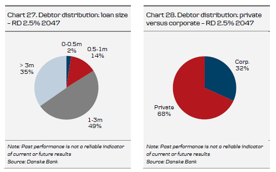

## Prepayment

Borrowers raising a callable mortgage loan are entitled to prepay the mortgage at par prior to maturity. A borrower’s right to prepay is embedded in one or two prepayment options

* Callable loans have an embedded call option and a delivery option.

* Non-callable loans have an embedded delivery option only.

To comply with the specific balance principle described in section \@ref(balance), the borrower’s call option must be embedded in issued covered bonds in order to achieve a perfect hedge, i.e. the mortgage banks do not suffer a loss when call options are exercised. The delivery option is embedded in almost all loans originated by Danish mortgage banks. It should be stressed that a loan does not necessarily have to be terminated or prepaid when a property changes hands. Accordingly, when a property is sold, the mortgage bank decides whether the new
owner can take over the loan.

If a borrower wants to exercise the call option and prepay a loan at par, he may choose between immediate prepayment and prepayment on the payment date. The former is the most common choice. Borrowers must give two months’ notice before exercising the call option, i.e. notification dates are 31 January, 30 April, 31 July and 31 October.

About 40 days prior to the payment date, accurate information on the prepayment volumes for the individual bond series is available on the publication date. Extraordinary prepayments are distributed among investors according to the same principle of drawing as described above for ordinary repayments (see Chapter 5). The bond trades ex-principal (exprepayment) two days before the term date31

Immediate prepayment means that the remaining debt and interest payments are payable to the mortgage bank within three days, i.e. prior to the payment date. However, as investors are still entitled to their coupon payments, the borrower still has to pay the coupon until the payment date (1 January, 1 April, 1 July and 1 October), which, in principle, is the first date on which the loan may be prepaid.

Thus, the borrower prepays the remaining principal plus the coupon payment for the period until the payment date. The borrower is compensated for making the funds available to the mortgage bank until the payment date (see chart below). This compensation is normally calculated at a rate close to the current money-market rate.

Prepayment on the payment date means that the borrower does not have to prepay the
remaining principal and the coupon due until the payment date.

When a borrower prepays a loan, it usually raises a new one. This involves two separate transactions and the borrower is therefore free to raise a mortgage loan with a different mortgage bank than the one with which the repaid loan was raised.

When a borrower exercises the delivery option, the underlying bonds are purchased at market price. By delivering the bonds to the mortgage bank, the loan is – fully or partially – redeemed. The borrower runs the hypothetical risk of not being able to buy the bond due to lock-in effects and the mortgage banks suffer no loss when the option is exercised.

Borrowers will exercise the delivery option only if the bond price is below par and will be charged a trading fee typically of 0.10-0.30% depending on the loan size.

Observed prepayment rates are indicated in the chart below and include both delivery and call option prepayments. As can be seen, observed prepayments are closely correlated to a decline in long-term interest rates, suggesting that remortgaging at a lower interest rate is the main reason for prepayment.

```{r prepaymentvsswap, echo = FALSE, fig.align='center', out.width="100%", fig.cap="Pricing curve of Callabalbe Bonds and Non-callable bonds."}
knitr::include_graphics("figure/Interest_rate_and_prepayment_correlation.png")
```


### Calculating prepayment gains

Most Danish mortgage loans are prepaid in connection with remortgaging (debt management) or in connection with the sale of a house (though prepayment is not compulsory, as the loan may be taken over by the new owner).

The advisory services provided by banks and mortgage banks focus on the gain on the first year’s net payments and on the net present value of the old loan and the new loan alternative.

Today, borrowers focus primarily on liquidity savings in the form of lower net payments and their required gains are therefore measured mainly in terms of the difference between the first year’s net payments on the existing loan and the new loan. In some cases, the first year’s net payments are reduced but the gain measured in terms of the net present value of future payments is negative. This would typically be the case if the borrower chooses to raise a loan with a longer term to maturity than the old loan. Under such circumstances, some borrowers will want to refinance, while others prefer to wait until the net present value gain is positive and above a threshold level.

The second parameter in the advisory service is the difference in net present values, also called the prepayment gain

The calculation of the prepayment gain is very sensitive to the yield curve applied. In practice, a flat yield curve corresponding to the after-tax yield on the refinancing alternative is often applied. The prepayment gain can be calculated using the following formula.

$$
\text { Prepayment gain }=\frac{\text { NPV }(\text { old loan })-(\text { rem. debt }+\text { costs }) \cdot \text { Disc }}{N P V(\text { old loan })}
$$
NPV (old loan) is the net present value of the old loan, corresponding to the remaining after-tax payments discounted at the after-tax yield of the new refinancing alternative. The rem. debt is the remaining debt to be refinanced and costs are the refinancing costs. Disc is the discounting factor from the payment date to the actual date on which the borrower decides to prepay the loan (no later than the notification date).

The borrower will most often be advised to refinance the mortgage based on a financial gain calculated in percent (as shown above) but also in absolute value.

### Different types of remortgaging strategies

Borrowers have gradually become more conscious of managing their debt and increasingly use different remortgaging strategies to optimise their home financing.

Their choice of remortgaging strategy is heavily dependent on interest rate movements since the existing loan was raised and, in certain cases, the borrower’s expectations with regard to future changes in interest rates. Below we set out a brief description of the most commonly used remortgaging strategies.

Following a substantial decline in interest rates, borrowers will benefit from remortgaging an existing loan to a new loan with a lower nominal rate of interest, as described above. The borrower will receive a gain in the form of lower future net payments and thus lower first-year net payments due to the lower interest rate. However, this type of remortgaging typically results in an increase in outstanding debt, depending on the price of the bonds underlying the new loan.

Following substantial increases in long-term interest rates, the borrower is able to reduce the outstanding debt by redeeming the old loan at a low market price and refinancing it through new bonds at a higher coupon than that of the original loan. However, this type of remortgaging leads to rising future payments because of the higher interest payments. Such remortgaging is therefore profitable only if interest rates decline again within a short time period. Borrowers initially achieve a reduction in their outstanding debt at the expense of higher payments, which they hope to be able to reduce by remortgaging to a lower coupon later.

The introduction of interest-reset loans (see Chapter 5) formed the basis of a new type of remortgaging strategy. In periods of rising long-term interest rates and a substantial steepening of the yield curve and in periods of plunging short-term interest rates, borrowers holding a loan funded by long-term fixed rate bonds may remortgage their loans by redeeming the loan and refinancing it by raising a loan based on short-term bonds. The gain achieved from adopting this strategy is a reduction in the outstanding debt and lower future mortgage payments, assuming that future short-term refinancing rates remain low. In the opposite case, where long-term interest rates have plummeted and short-term interest rates are higher than long-term interest rates, the borrower is able to reduce his mortgage payments by remortgaging from an interest-reset loan based on short-term bonds to a fixed interest rate loan based on long-term bonds.

Following the introduction of interest-reset loans, borrowers have greater opportunities for achieving future remortgaging gains because redemption of the existing loan and disbursement of the new loan may take place at interest rates across the yield curve.

### Remortgage gain depends on several factors

The remortgaging gain generally depends on several debtor-specific factors. Hence, it is of significance whether the borrower is a private individual or a corporate borrower because the tax deduction rate for interest paid by the borrower varies. However, in recent years, the tax deduction rate for private borrowers has been gradually.

In ‘The Whitsun Package’, which was part of the 1998 tax reform, the tax deduction rate for private individuals was reduced from an average of 46% to 33% and in the most recent tax reform, ‘Forårspakken 2.0’ from February 2009, the tax deduction rate was reduced yet again from 33% to 25% over a transitional period from 2012 to 2019. The deductible rate for businesses has also been reduced in recent years and stands at 22% today, compared with 34% in 1998.

Moreover, the size of the remaining principal typically determines the remortgaging gain. If the remaining principal is small, the refinancing costs in the form of a fixed fee weigh more. The gain is therefore relatively smaller than for a large remaining principal.

Finally, the remortgaging gain may depend on the term to maturity. Hence, the achieved gain is typically greater when refinancing a 30-year loan than when financing a shorter -term loan.

In recent years, greater attention in the media and campaigns launched by mortgage banks have resulted in borrowers responding more quickly to the opportunities for a remortgaging gain.

Advisory services have also become more sophisticated and borrowers are able to have their refinancing opportunities monitored, meaning they are contacted when the remortgaging gain exceeds a pre-agreed level.

## Estimating prepayments

Estimating prepayments is essential to the pricing of callable covered bonds — not just for the coming payment date but also for all future payment dates. Prepayments are important to investors as they affect cash flows. As a result, the duration of callable bonds is affected by changes in the estimated prepayment rates.

There are several different models for estimating prepayments, one of the most commonly used being the so-called capital gain requirement model where the parameters of the model are estimated based on historical prepayment data. This model assumes that a given debtor will refinance his loan if the obtainable remortgaging gain is greater than his debtor-specific required gain. Furthermore, the model allows for different debtor patterns by assuming that the various groups in the debtor distribution behave differently when it comes to borrowers’ inclination to refinance at various rates. Before 1 January 2016, Danske Bank also used such a model to estimate the risk of callable bonds. In the section Danske Bank’s old model for callable bonds (traditional model), we have described our old model, which in many ways is similar to other banks’ models for callable bonds.

Instead of using a traditional method/model to estimate future levels of prepayments for callable bonds, Danske Bank has chosen a new path. Our new model approach is not to estimate future prepayments based on historical prepayments data (as we did before with the traditional model), but to estimate the prepayments implied by the market. Hence, this is a new and unique method to calculate the risk of callable bonds.

### Data for estimating prepayments

One of the most important factors affecting a borrower’s prepayment decision is the gain from refinancing as described in Chapter 7. Historical prepayment rates and debtor distributions are used in the estimation of the parameters in traditional capital gain requirement models (traditional models).

Historical prepayment rates for each series give a first impression of the remortgaging sensitivity of a bond series. Traditionally, series that have experienced significant prepayments can be characterised as ‘having lost their prepayment potential’ as the remaining borrowers have presumably been able to realise decent refinancing gains at an earlier date. However, we increasingly see so-called burned-out series continuing to experience high prepayment rates.

The debtor distribution of a bond series is a breakdown of the total underlying remaining debt. A debtor distribution table breaks down loans into five groups according to the size of the remaining debt in DKKm, the share of cash and bond loans and the share of corporate and private loans. This type of distribution makes it possible to divide borrowers into 20 debtor groups.

In traditional models, large corporate loans are generally assumed to have a higher remortgaging rate than small private loans, because these loans, due to the higher remaining principal, have a lower percentage cost when prepaying. The size of the remaining principal is important due to both its relation to fixed remortgaging costs and the psychological factor that makes a gain of DKK100,000 more tempting than a gain of DKK1,000.


```{r prepay, echo = FALSE, fig.align='center', out.width="100%", fig.cap="Pricing curve of Callabalbe Bonds and Non-callable bonds."}
knitr::include_graphics("figure/prepay.png")
```


```{r debitor, echo = FALSE, fig.align='center', out.width="100%", fig.cap="Pricing curve of Callabalbe Bonds and Non-callable bonds."}

```

Every week, the individual mortgage banks publish preliminary prepayments for each
series for future, non-published payment dates. These prepayments allow for an estimation of the volume of prepayments for the next payment date (comparison with previous payment dates). They also allow for a calculation of the share of total prepayments for a given announced preliminary prepayment by using prepayment data at the same time prior to the previous payment date. The preliminary prepayment rates are used in Danske Bank’s new model (SuperFly) and in the old model (Danske Analytics).

Typically, preliminary prepayments are characterised by a strong exponential increase up to expiry of the notification period. Any expectation based on announced prepayments therefore becomes more reliable as the expiry of the notification period approaches. One may also track any differences between the institutions up to the notification date.


```{r PrepaymentRates, echo = FALSE, fig.align='center', out.width="100%", fig.cap="Pricing curve of Callabalbe Bonds and Non-callable bonds."}
knitr::include_graphics("figure/evolution in prepayments.png")
```
